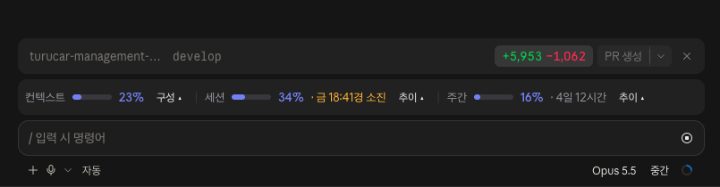
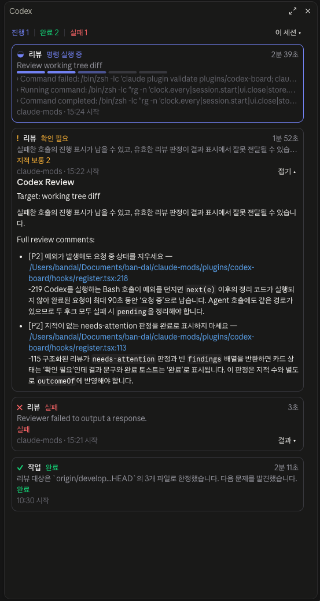

# claude-mods

Claude Code mod 마켓플레이스.

## 설치

```bash
claude plugin marketplace add ban-dal/claude-mods
claude plugin install usage-meter@claude-mods
claude plugin install codex-board@claude-mods
```

## Mods

### usage-meter

프롬프트 위에 컨텍스트 사용량, 프롬프트 캐시, 세션(5시간) 한도, 주간(7일) 한도, 세션 비용을 한 줄로 표시한다.



- Desktop은 항목마다 항목색 배경의 칩으로 표시 (terminal은 `◔` `↯` `◷` `▦` `$` 글자)
- 세션/주간 막대의 세로선은 구간 경과 위치: 막대가 이를 앞서면 시간보다 빨리 쓰는 중
- 리셋 전에 한도가 소진될 속도면 남은 시간 대신 소진 예상 시각을 표시
- 캐시: 직전 응답의 적중률과 만료(TTL 1시간)까지 남은 시간, 5분 안으로 남으면 경고색
- `상세`: 상세 패널. 탭으로 컨텍스트 구성(항목별 토큰), 캐시 상세(직전 응답의 읽기·쓰기·미캐시 토큰, 세션 누적), 세션/주간 사용 추이 그래프와 리셋 시 예상 사용률을 전환
- 한도 80%·90%, 컨텍스트 90% 도달 시 토스트
- `/usage-meter`: 표시/숨기기

### codex-board

[Codex 플러그인](https://github.com/openai/codex-plugin-cc)으로 요청한 리뷰·작업의 진행 상황을 우측 패널에 표시한다.



- codex-companion이 남기는 상태 파일(`~/.claude/plugins/data/codex-*/state`)을 읽어 단계, 경과 시간, 최근 로그를 갱신
- 리뷰가 끝나면 판정과 심각도별 지적 수를 표시하고, `결과`로 지적 목록이나 원문을 펼침
- 작업별 model·effort 표시: 작업 파일의 요청 값 → 요청 명령의 `--model`·`--effort` → `~/.codex/config.toml` 순으로 확인
- 로그가 30초 넘게 멈추면 마지막 활동 시각을 경고색으로 표시하고, 10분 넘게 멈추면 이 세션의 작업을 `codex-companion cancel`로 자동 종료
- 이 세션에서 Codex 작업이 시작되면 패널을 자동으로 열고, 끝나면 토스트
- 범위: 이 세션(현재 레포 포함) / 전체
- `/codex-board`: 패널 열기/닫기 (열어 두면 다음 세션에도 열림)

## 개발

```bash
claude plugin validate plugins/usage-meter
claude plugin test plugins/usage-meter
claude plugin validate plugins/codex-board
claude plugin test plugins/codex-board
```
